
# Manual del Administrador
## Armario Inteligente de Llaves

**Versión:** 1.0
**Idioma:** Español
**Destinatario:** Administrador del sistema

---

## Índice

1. [Introducción](#introduccion)
   - [¿Qué es el sistema?](#que-es)
   - [Componentes del sistema](#componentes)
   - [Niveles de acceso](#niveles)
2. [Primeros pasos](#primeros-pasos)
   - [Encendido y pantalla de inicio](#encendido)
   - [Identificación por NFC](#login-nfc)
   - [Identificación por contraseña](#login-password)
   - [Cierre de sesión automático](#cierre-sesion)
3. [Navegación entre pantallas](#navegacion)
4. [Uso básico — Retirar y devolver llaves](#uso-basico)
   - [Retirar una llave](#retirar)
   - [Devolver una llave](#devolver)
5. [Gestión de llaves](#gestion-llaves)
   - [Ver el listado de llaves](#ver-llaves)
   - [Crear una llave](#crear-llave)
   - [Editar una llave](#editar-llave)
   - [Activar y desactivar llaves](#activar-llave)
   - [Gestionar qué usuarios tienen acceso](#acceso-llave)
6. [Gestión de usuarios](#gestion-usuarios)
   - [Ver el listado de usuarios](#ver-usuarios)
   - [Crear un usuario](#crear-usuario)
   - [Editar un usuario](#editar-usuario)
   - [Gestionar el acceso de un usuario a las llaves](#acceso-usuario)
7. [Historial de acciones](#historial)
   - [Historial global](#historial-global)
   - [Historial por llave o por usuario](#historial-filtrado)
8. [Control directo de solenoides](#solenoides)
9. [Configuración](#configuracion)
   - [Cambio de idioma](#idioma)
10. [Estructura de la base de datos](#base-de-datos)
11. [Solución de problemas](#problemas)
12. [Apéndice](#apendice)
    - [Tabla de posiciones del armario](#tabla-posiciones)
    - [Glosario](#glosario)

---

## 1. Introducción

### ¿Qué es el sistema?

El Armario Inteligente de Llaves es un sistema de gestión y custodia de llaves físicas diseñado para entornos empresariales. Permite controlar qué usuarios tienen acceso a cada llave, registrar cada retirada y devolución, y actuar sobre las cerraduras del armario de forma electrónica.

El sistema corre sobre una Raspberry Pi 4 y presenta una interfaz táctil de tipo kiosco, sin necesidad de teclado ni ratón para el uso habitual. La identificación de usuarios y llaves se realiza mediante tecnología NFC o, como alternativa, mediante contraseña numérica.

Toda la actividad queda registrada en una base de datos local, garantizando la trazabilidad completa del armario sin depender de conexión a internet.

---

### Componentes del sistema

> *Captura pendiente: foto del armario completo con pantalla y lector NFC visibles.*

| Componente | Descripción |
|------------|-------------|
| **Raspberry Pi 4** (2 GB RAM) | Unidad central. Ejecuta el software, la base de datos y gestiona todos los periféricos. |
| **Pantalla táctil IPS 7"** (1024×600) | Interfaz de usuario. Conexión USB. Incluye altavoces para retroalimentación auditiva. |
| **Lector NFC PN532** | Identifica tarjetas y llaveros NFC. Conectado por I2C. Soporta estándar ISO 14443A. |
| **Módulo de 16 relés (XL9535)** | Controla los solenoides del armario. Conectado por I2C, con aislamiento galvánico. |
| **Teclado numérico USB** | Alternativa a la identificación NFC para introducir contraseñas. |
| **Armario** | 4 filas × 8 columnas = **32 posiciones** (A1–D8). Cada posición tiene un solenoide, un LED indicador y un diodo de protección. |

**Fuentes de alimentación:**
El sistema usa dos fuentes independientes — 5 V para la electrónica de control y 12 V para los solenoides — garantizando aislamiento eléctrico entre ambos circuitos.

---

### Niveles de acceso

El sistema define tres niveles de acceso. Cada nivel hereda las capacidades del anterior.

| Nivel | Nombre | Capacidades |
|-------|--------|-------------|
| **0** | Usuario básico | Consultar sus llaves asignadas. Retirar y devolver llaves. |
| **1** | Usuario medio | Todo lo anterior, más: crear llaves, editar sus llaves visibles, gestionar qué usuarios tienen acceso a ellas. |
| **2** | Administrador | Control total: gestión de todos los usuarios y llaves del sistema, historial completo, control directo de solenoides. |

> **Nota:** Las opciones de administración no aparecen en pantalla para usuarios sin el nivel requerido. No se muestran bloqueadas, simplemente no existen para ellos.

La interfaz adapta automáticamente las opciones visibles al nivel del usuario identificado.

---

## 2. Primeros pasos

### Encendido y pantalla de inicio

Al arrancar el sistema aparece la pantalla de inicio. Desde aquí se pueden realizar dos acciones sin autenticación de usuario:

- **Identificar un llavero NFC** para devolver directamente una llave sin necesidad de iniciar sesión.
- **Identificarse como usuario** (por NFC o contraseña) para acceder al panel principal.

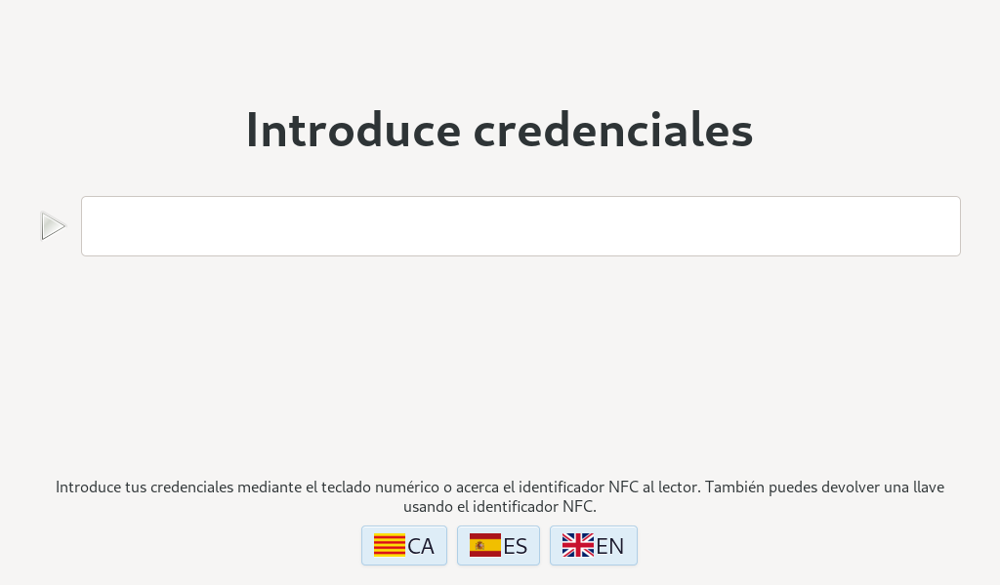

---

### Identificación por NFC

1. Acerque su tarjeta o llavero NFC al lector (módulo PN532, ubicado al lado del panel).
2. El sistema lee el identificador único (UID) del tag.
3. Si el UID corresponde a un **usuario**, se abre el panel principal con el nivel de acceso correspondiente.
4. Si el UID corresponde a una **llave activa**, se inicia el flujo de devolución directa (sin sesión de usuario).
5. Si el UID no está registrado o está duplicado, el sistema muestra un mensaje de error con el motivo exacto.

> **Nota:** La identificación por NFC es el método recomendado. Elimina errores tipográficos y agiliza el proceso.

---

### Identificación por contraseña

1. En la pantalla de inicio, introduzca su contraseña numérica mediante el teclado numérico o el teclado en pantalla.
2. El sistema busca el usuario asociado a esa contraseña.
3. Si la contraseña es correcta, se abre el panel principal.
4. Si es incorrecta, el sistema muestra un mensaje de error.

> **Aviso:** Las contraseñas son numéricas. El teclado físico del armario solo dispone de dígitos.

---

### Cierre de sesión automático

El sistema cierra la sesión de tres formas:

- **Automáticamente**, tras **30 segundos de inactividad**. Evita que una sesión quede abierta si el usuario se aleja sin cerrarla manualmente. Cualquier interacción con la pantalla reinicia el contador.
- **Pulsando el botón de retroceso** repetidamente hasta volver a la pantalla de inicio.
- **Pulsando el botón Salir**, disponible en el panel principal.

---

## 3. Navegación entre pantallas

El siguiente diagrama muestra todas las pantallas del sistema y las transiciones posibles entre ellas. El color de cada pantalla indica el nivel de acceso mínimo requerido para acceder a ella:

- **Azul** — accesible por cualquier usuario (nivel 0 y superiores)
- **Verde** — requiere usuario medio o superior (nivel 1+)
- **Amarillo** — exclusivo del administrador (nivel 2)

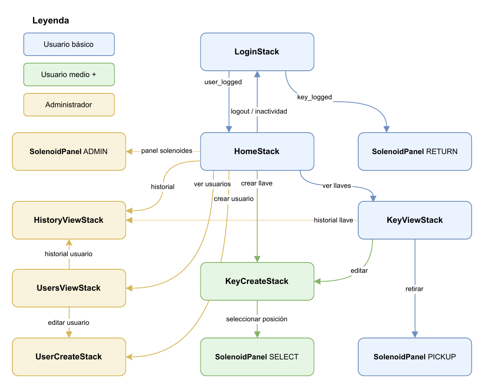

El sistema tiene dos flujos de entrada independientes desde la pantalla de inicio (**LoginStack**):

- **Flujo de usuario:** el usuario se identifica (NFC o contraseña) → accede al panel principal (**HomeStack**).
- **Flujo de devolución directa:** se acerca un llavero NFC → el sistema abre directamente el panel de solenoides en modo devolución, sin necesidad de iniciar sesión.

### Pantallas del sistema

| Pantalla | Descripción | Nivel mínimo |
|----------|-------------|:---:|
| **LoginStack** | Pantalla de inicio. Identificación de usuarios y llaves. | 0 |
| **HomeStack** | Panel principal tras identificarse. Punto de acceso al resto de secciones. | 0 |
| **KeyViewStack** | Listado de llaves. Permite retirar, editar, gestionar accesos y ver historial. | 0 |
| **KeyCreateStack** | Formulario de creación y edición de llaves. | 1 |
| **UsersViewStack** | Listado de usuarios. Permite editar, gestionar accesos y ver historial. | 2 |
| **UserCreateStack** | Formulario de creación y edición de usuarios. | 2 |
| **HistoryViewStack** | Historial de acciones. Accesible en modo global, por llave o por usuario. | 2 |
| **SolenoidPanel** | Panel de solenoides. Opera en cuatro modos según el contexto. | 0* |

> **Nota:** El **SolenoidPanel** es accesible sin sesión solo en el modo de devolución directa. Los modos de administración y selección requieren nivel 2 y nivel 1 respectivamente.

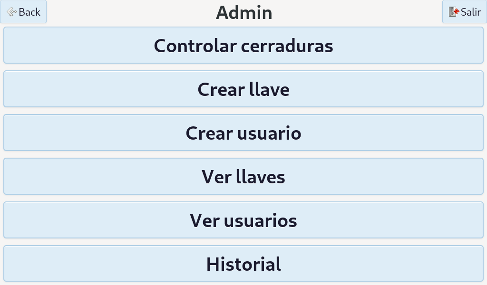

### Navegación cruzada

Desde **KeyViewStack** se puede acceder directamente a **UsersViewStack** (y viceversa) para gestionar accesos sin volver al panel principal. Esta navegación funciona tanto en modo visualización como en modo selección.

El **HistoryViewStack** es accesible desde tres puntos distintos: desde **HomeStack** (historial global), desde **KeyViewStack** (historial de una llave) y desde **UsersViewStack** (historial de un usuario).

---

## 4. Uso básico — Retirar y devolver llaves

### Retirar una llave

1. Identifíquese en la pantalla de inicio.
2. En el panel principal, acceda a **Ver llaves**.
3. El sistema muestra solo las llaves a las que tiene acceso.
4. Seleccione la llave que desea retirar.
5. El sistema abre el solenoide de la posición correspondiente y muestra una cuenta atrás de **20 segundos**.
6. Retire la llave. El sistema registra la acción en el historial y cierra la sesión.

Si necesita más tiempo, pulse **Repetir** para reiniciar el temporizador. Al expirar la cuenta atrás sin haber retirado la llave, el solenoide se cierra y la sesión finaliza automáticamente.

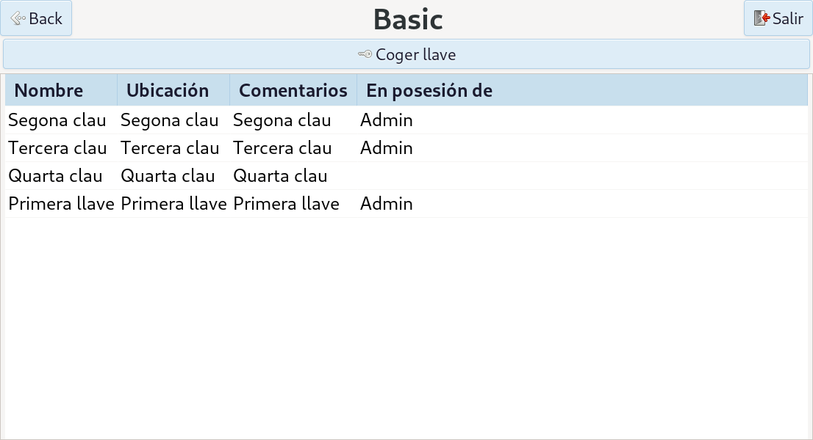

> **Aviso:** Si la llave ya está en posesión de otro usuario, el sistema muestra un aviso y no abre el solenoide.

---

### Devolver una llave

La devolución se realiza **sin necesidad de iniciar sesión**:

1. Acerque el llavero NFC al lector desde la pantalla de inicio.
2. El sistema identifica la llave y abre la posición correspondiente en el armario, mostrando una cuenta atrás de **20 segundos**.
3. Deposite la llave en la posición indicada.
4. El sistema registra la devolución en el historial y marca la llave como disponible.

Si necesita más tiempo, pulse **Repetir** para reiniciar el temporizador. Al expirar la cuenta atrás, el solenoide se cierra automáticamente.

> **Nota:** La devolución requiere obligatoriamente el llavero NFC. No es posible devolver una llave introduciendo una contraseña, lo que añade una capa de seguridad al proceso.

---

## 5. Gestión de llaves

Esta sección es accesible para usuarios de **nivel 1 (medio) y superiores**. Los usuarios de nivel 1 solo pueden gestionar las llaves que tienen visibles; el administrador tiene acceso a todas.

### Ver el listado de llaves

Desde el panel principal, acceda a **Llaves**. El listado muestra:

| Columna | Descripción |
|---------|-------------|
| **Nombre** | Nombre descriptivo de la llave. |
| **Ubicación** | Lugar físico al que da acceso la llave. |
| **Comentarios** | Información adicional sobre la llave. |
| **Posición** | Ranura del armario donde está guardada (ej. A2). |
| **En posesión de** | Nombre del usuario que la tiene retirada, o vacío si está disponible. |

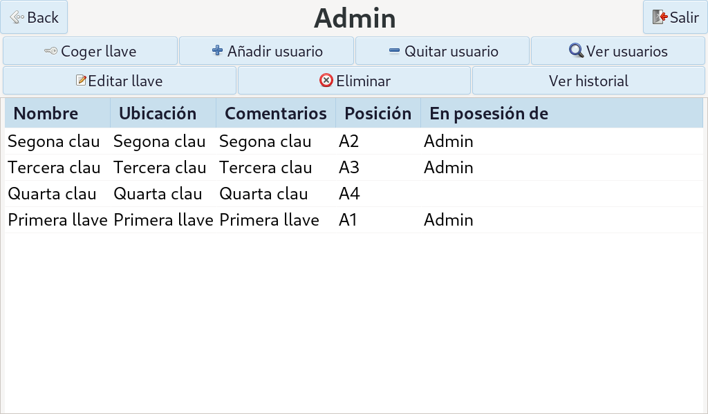

---

### Crear una llave

1. En el listado de llaves, pulse **Nueva llave**.
2. Rellene el formulario:

| Campo | Descripción |
|-------|-------------|
| **Nombre** | Identificador descriptivo de la llave (ej. "Llave almacén norte"). |
| **Ubicación** | Lugar físico al que da acceso la llave. |
| **Comentario** | Información adicional (ej. horarios, puertas del llavero). |
| **Posición en armario** | Ranura física donde se guardará la llave (A1–D8). |
| **Tag NFC** | UID del llavero NFC asociado. Se registra acercando el llavero al lector. |

3. Para asignar la posición física, pulse **Seleccionar posición**. El sistema abre el panel de solenoides en modo selección, donde puede elegir una ranura libre pulsándola directamente.
4. Pulse **Guardar**. La llave queda registrada en la base de datos.

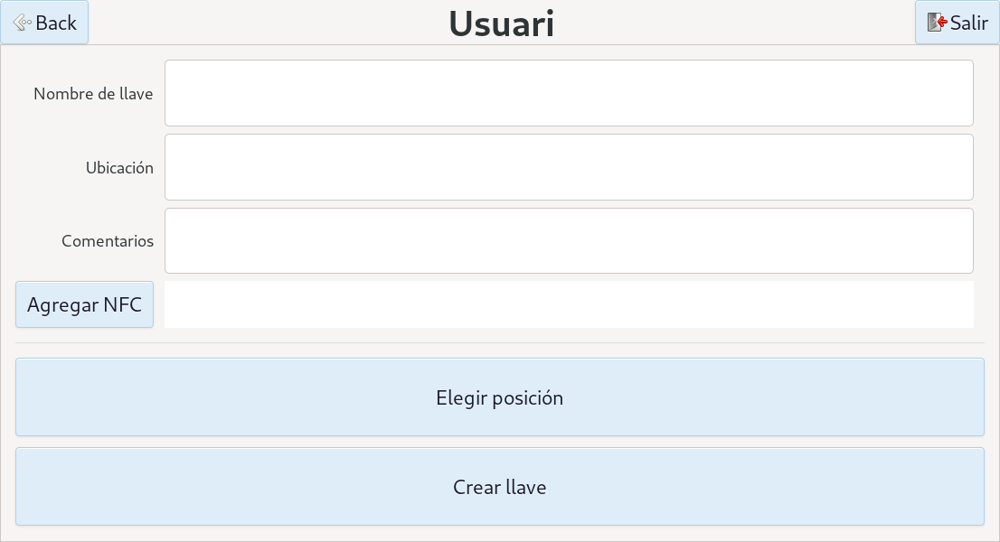

---

### Editar una llave

1. En el listado de llaves, seleccione la llave y pulse **Editar**.
2. Modifique los campos que desee (nombre, ubicación, comentario, tag NFC).
3. Pulse **Guardar**.

---

### Activar y desactivar llaves

Una llave puede marcarse como **inactiva** cuando se da de baja temporalmente (pérdida, mantenimiento, etc.) sin eliminarla del sistema. Esto la excluye de los listados de uso pero conserva su historial.

Para reactivarla, edítela y cambie su estado a activa.

---

### Gestionar qué usuarios tienen acceso

1. En el listado de llaves, seleccione la llave.
2. Pulse **Gestionar accesos**.
3. El sistema muestra el listado de usuarios con acceso a esa llave.
4. Para **añadir** un usuario: pulse **Añadir** y selecciónelo del listado de usuarios.
5. Para **retirar** el acceso: seleccione el usuario en la lista y pulse **Eliminar acceso**.

> **Nota:** Retirar el acceso a un usuario no devuelve la llave si la tiene en su poder. Verifique el [historial](#historial) si necesita saber dónde está la llave.

---

## 6. Gestión de usuarios

Esta sección es exclusiva del **administrador (nivel 2)**.

### Ver el listado de usuarios

Desde el panel principal, acceda a **Usuarios**. El listado muestra:

| Columna | Descripción |
|---------|-------------|
| **Nombre** | Nombre del usuario. |
| **Contraseña** | Contraseña numérica del usuario. |
| **Uid** | Identificador NFC asociado al usuario. |

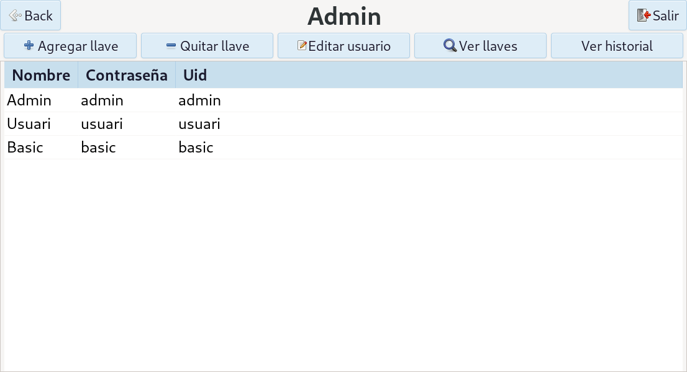

---

### Crear un usuario

1. En el listado de usuarios, pulse **Nuevo usuario**.
2. Rellene el formulario:

| Campo | Descripción |
|-------|-------------|
| **Nombre** | Nombre del usuario. |
| **Contraseña** | Contraseña numérica (alternativa al NFC). |
| **Tag NFC** | UID de la tarjeta o llavero NFC del usuario. Se registra acercando el tag al lector. |
| **Nivel de acceso** | 0 (básico), 1 (medio) o 2 (administrador). |

3. Pulse **Guardar**.

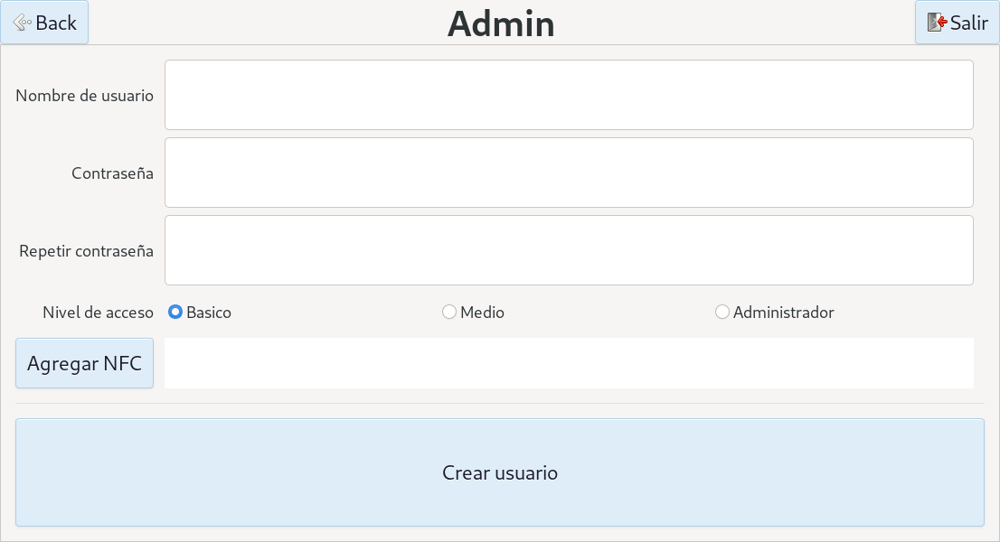

---

### Editar un usuario

1. En el listado de usuarios, seleccione el usuario y pulse **Editar**.
2. Modifique los campos necesarios (nombre, contraseña, tag NFC, nivel).
3. Pulse **Guardar**.

> **Aviso:** Cambiar el nivel de acceso de un usuario tiene efecto inmediato en la siguiente sesión.

---

### Gestionar el acceso de un usuario a las llaves

1. En el listado de usuarios, seleccione el usuario.
2. Pulse **Gestionar llaves**.
3. El sistema muestra las llaves a las que tiene acceso ese usuario.
4. Para **añadir** una llave: pulse **Añadir** y selecciónela del listado.
5. Para **retirar** el acceso: seleccione la llave y pulse **Eliminar acceso**.

---

## 7. Historial de acciones

El historial registra de forma permanente cada acción relevante del sistema. Los registros son **inmutables**: aunque se elimine una llave o un usuario, sus eventos históricos se conservan con los datos tal y como estaban en el momento de la acción.

Cada registro contiene:

| Campo | Descripción |
|-------|-------------|
| **Tipo de evento** | Retirada, devolución, llave desactivada, apertura de administrador, etc. |
| **Fecha y hora** | Marca de tiempo exacta del evento. |
| **Usuario** | Nombre e identificador del usuario implicado. |
| **Llave** | Nombre e identificador de la llave implicada. |
| **Posición** | Ranura del armario en el momento del evento. |

### Historial global

Accesible desde el panel principal → **Historial**. Muestra todos los eventos del sistema ordenados cronológicamente.

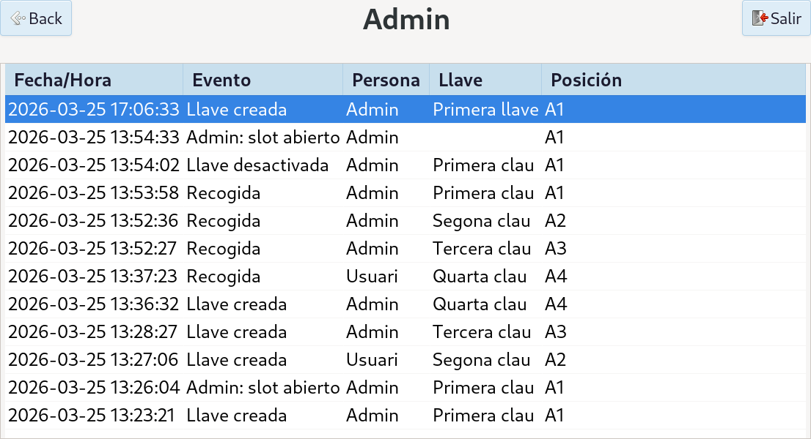

---

### Historial por llave o por usuario

El historial puede filtrarse sin salir del contexto en el que se trabaja:

- Desde **Llaves** → seleccionar una llave → **Ver historial**: muestra solo los eventos de esa llave.
- Desde **Usuarios** → seleccionar un usuario → **Ver historial**: muestra solo los eventos de ese usuario.

---

## 8. Control directo de solenoides

Exclusivo del **administrador (nivel 2)**. Permite abrir o cerrar cualquier ranura del armario manualmente, independientemente de si hay una llave registrada en esa posición.

Acceso: panel principal → **Panel de solenoides** (modo ADMIN).

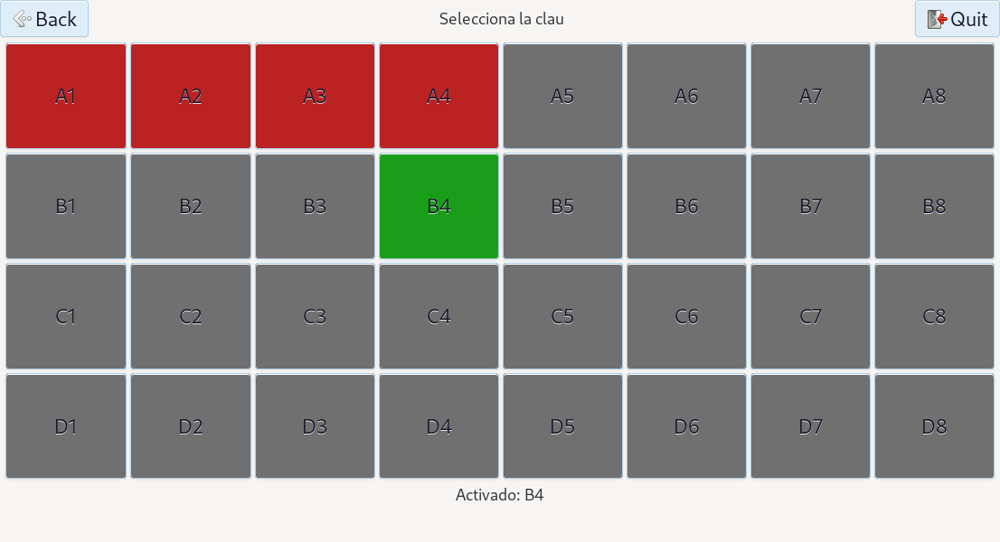

El panel muestra una cuadrícula de 4 × 8 posiciones que reproduce la distribución física del armario. Cada posición tiene un color indicador:

| Color | Significado |
|-------|-------------|
| **Gris** | Posición vacía, sin llave registrada. |
| **Verde** |Posición abierta. |
| **Rojo** | Posición asignada. |

Para **abrir una ranura**: pulse la posición deseada. El solenoide se activa y puede extraerse la llave manualmente.
Para **cerrarla**: pulse de nuevo la misma posición.

Solo puede haber una ranura abierta simultáneamente. Al pulsar una nueva posición, la anterior se cierra automáticamente.

> **Aviso:** Este modo actúa directamente sobre el hardware. Utilícelo solo para mantenimiento o resolución de incidencias.

---

## 9. Configuración

### Cambio de idioma

El sistema está disponible en tres idiomas: **Español**, **Català** e **English**.

El cambio de idioma se aplica de forma inmediata a toda la interfaz sin necesidad de reiniciar.

---

## 10. Estructura de la base de datos

La base de datos es local, gestionada por **MariaDB** a través de la capa de abstracción **LiteSQL**. Contiene las siguientes tablas:

### Tabla `Person` — Usuarios

| Campo | Tipo | Descripción |
|-------|------|-------------|
| `id` | Entero | Identificador único del usuario. |
| `name` | Texto | Nombre del usuario. |
| `password` | Texto | Contraseña numérica. |
| `uid` | Texto | UID del tag NFC asociado. |
| `a1` | Booleano | Nivel medio si es `true`. |
| `a2` | Booleano | Administrador si es `true`. |
| `type` | Texto | Tipo de entidad (uso interno de LiteSQL). |

---

### Tabla `Key` — Llaves

| Campo | Tipo | Descripción |
|-------|------|-------------|
| `id` | Entero | Identificador único de la llave. |
| `name` | Texto | Nombre descriptivo. |
| `ubi` | Texto | Ubicación física (campo libre). |
| `commentary` | Texto | Comentario adicional. |
| `pos` | Entero | Posición en el armario (0–31, equivale a A1–D8). |
| `active` | Booleano | `false` si la llave está dada de baja. |
| `uid` | Texto | UID del tag NFC del llavero. |
| `type` | Texto | Tipo de entidad (uso interno de LiteSQL). |

---

### Tabla `HistoryEvent` — Historial

| Campo | Tipo | Descripción |
|-------|------|-------------|
| `id` | Entero | Identificador del evento. |
| `event_type` | Texto | Tipo: `pickup`, `return`, `key_deactivated`, `admin_open`, etc. |
| `timestamp` | Texto | Fecha y hora del evento. |
| `user_id` | Entero | ID del usuario en el momento del evento. |
| `user_name` | Texto | Nombre del usuario (copia inmutable). |
| `key_id` | Entero | ID de la llave en el momento del evento. |
| `key_name` | Texto | Nombre de la llave (copia inmutable). |
| `key_pos` | Texto | Posición de la llave (ej. `B4`). |

> **Nota:** El historial almacena copias de los datos en el momento del evento. Si posteriormente se renombra o elimina una llave o usuario, los registros históricos no se ven afectados.

---

### Relaciones entre tablas

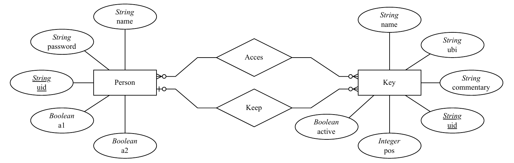

**`Key_Person_Acces`** — relación muchos a muchos entre `Key` y `Person`.
Registra a qué llaves tiene acceso cada usuario. Un usuario puede tener acceso a ninguna, una o varias llaves; una llave puede ser accesible por varios usuarios.

**`Key_Person_Keep`** — relación uno a uno opcional entre `Key` y `Person`.
Registra qué usuario tiene actualmente cada llave en su posesión. Una llave solo puede estar en poder de un usuario a la vez (restricción `UNIQUE`). Si la llave está en el armario, esta relación está vacía para esa llave.

---

## 11. Solución de problemas

| Síntoma | Causa probable | Acción |
|---------|---------------|--------|
| "UID no registrado" al acercar tag | El tag NFC no está en la base de datos. | Registre el usuario o la llave con ese tag desde el panel de administración. |
| "UID duplicado" al acercar tag | Dos registros tienen el mismo UID. | Acceda al panel de usuarios o llaves y corrija el UID duplicado. |
| "Contraseña incorrecta" | La contraseña introducida no coincide con ningún usuario. | Verifique la contraseña. Si es necesario, edite el usuario desde administración. |
| "Llave ya retirada por [nombre]" | La llave está en posesión de otro usuario. | Consulte el sus llaves para confirmar quién la tiene. Contacte con esa persona. |
| Solenoide no responde | Fallo de comunicación I2C o solenoide bloqueado mecánicamente. | Use el [panel de solenoides](#solenoides) para intentar abrirlo manualmente. Si persiste, revise el cableado I2C del módulo de relés. |
| La sesión se cierra sola | Temporizador de inactividad (30 s). | Comportamiento normal. Vuelva a identificarse. |
| El lector NFC no detecta tags | Distancia excesiva o tag incompatible. | Acerque el tag a menos de 3 cm del lector. Verifique que el tag es ISO 14443A (NTAG213, NTAG215 o similar). |

---

## 12. Apéndice

### Tabla de posiciones del armario

El armario tiene 32 posiciones organizadas en 4 filas y 8 columnas. La nomenclatura combina una letra de fila (A–D) con un número de columna (1–8).

|   | 1 | 2 | 3 | 4 | 5 | 6 | 7 | 8 |
|---|---|---|---|---|---|---|---|---|
| **A** | A1 | A2 | A3 | A4 | A5 | A6 | A7 | A8 |
| **B** | B1 | B2 | B3 | B4 | B5 | B6 | B7 | B8 |
| **C** | C1 | C2 | C3 | C4 | C5 | C6 | C7 | C8 |
| **D** | D1 | D2 | D3 | D4 | D5 | D6 | D7 | D8 |

La fila A corresponde a la fila superior del armario físico.

---

### Glosario

| Término | Definición |
|---------|------------|
| **NFC** | Near Field Communication. Tecnología inalámbrica de corto alcance (< 5 cm) para identificación de tags. |
| **Tag NFC** | Etiqueta o tarjeta con un chip NFC. Cada tag tiene un UID único de fábrica. |
| **UID** | Unique Identifier. Código único grabado en cada tag NFC. El sistema lo usa para identificar usuarios y llaves. |
| **Solenoide** | Actuador electromagnético que desbloquea mecánicamente la ranura de una llave al recibir corriente. |
| **I2C** | Bus de comunicación serie de dos hilos usado para conectar el lector NFC y el módulo de relés a la Raspberry Pi. |
| **LiteSQL** | Librería de abstracción de base de datos usada por el sistema. Permite operar con MariaDB mediante objetos C++. |
| **Kiosco** | Modo de funcionamiento en pantalla completa sin acceso al escritorio del sistema operativo. |
| **LoginStack** | Pantalla de inicio del sistema. |
| **HomeStack** | Panel principal que aparece tras identificarse. |
| **SolenoidPanel** | Panel de control de ranuras del armario. |
| **HistoryEvent** | Registro individual del historial de acciones. |

---

*Fin del manual.*

[Volver al índice](#indice)
