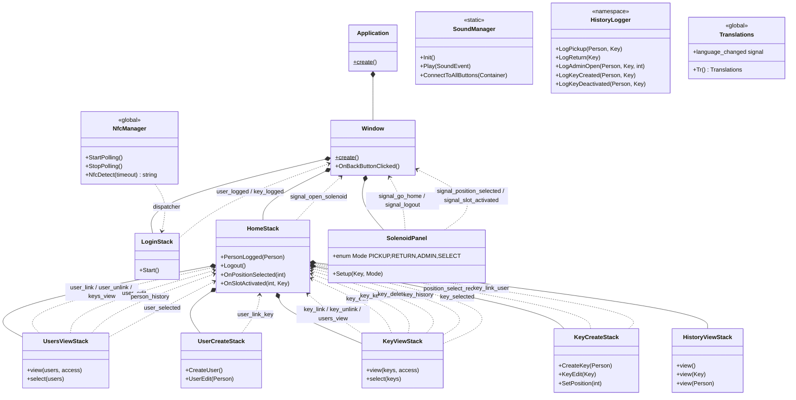

```mermaid
classDiagram
    direction TB

    class Application {
        +create()$
    }
    class Window {
        +create()$
        +OnBackButtonClicked()
    }
    class LoginStack {
        +Start()
    }
    class HomeStack {
        +PersonLogged(Person)
        +Logout()
        +OnPositionSelected(int)
        +OnSlotActivated(int, Key)
    }
    class SolenoidPanel {
        +enum Mode PICKUP,RETURN,ADMIN,SELECT
        +Setup(Key, Mode)
    }
    class NfcManager {
        <<global>>
        +StartPolling()
        +StopPolling()
        +NfcDetect(timeout) string
    }
    class SoundManager {
        <<static>>
        +Init()
        +Play(SoundEvent)
        +ConnectToAllButtons(Container)
    }
    class HistoryLogger {
        <<namespace>>
        +LogPickup(Person, Key)
        +LogReturn(Key)
        +LogAdminOpen(Person, Key, int)
        +LogKeyCreated(Person, Key)
        +LogKeyDeactivated(Person, Key)
    }
    class Translations {
        <<global>>
        +Tr() Translations
        +language_changed signal
    }
    class UsersViewStack {
        +view(users, access)
        +select(users)
    }
    class UserCreateStack {
        +CreateUser()
        +UserEdit(Person)
    }
    class KeyViewStack {
        +view(keys, access)
        +select(keys)
    }
    class KeyCreateStack {
        +CreateKey(Person)
        +KeyEdit(Key)
        +SetPosition(int)
    }
    class HistoryViewStack {
        +view()
        +view(Key)
        +view(Person)
    }

    Application *-- Window
    Window *-- LoginStack
    Window *-- HomeStack
    Window *-- SolenoidPanel
    HomeStack *-- UsersViewStack
    HomeStack *-- UserCreateStack
    HomeStack *-- KeyViewStack
    HomeStack *-- KeyCreateStack
    HomeStack *-- HistoryViewStack

    NfcManager ..> LoginStack : dispatcher
    LoginStack ..> Window : user_logged / key_logged
    HomeStack ..> Window : signal_open_solenoid
    SolenoidPanel ..> Window : signal_go_home / signal_logout
    SolenoidPanel ..> Window : signal_position_selected / signal_slot_activated

    UsersViewStack ..> HomeStack : user_link / user_unlink / keys_view
    UsersViewStack ..> HomeStack : user_edit
    UsersViewStack ..> HomeStack : person_history
    UsersViewStack ..> HomeStack : user_selected

    KeyViewStack ..> HomeStack : key_link / key_unlink / users_view
    KeyViewStack ..> HomeStack : key_edit
    KeyViewStack ..> HomeStack : key_kept
    KeyViewStack ..> HomeStack : key_delete
    KeyViewStack ..> HomeStack : key_history
    KeyViewStack ..> HomeStack : key_selected

    KeyCreateStack ..> HomeStack : position_select_requested
    KeyCreateStack ..> HomeStack : key_link_user
    UserCreateStack ..> HomeStack : user_link_key
```
