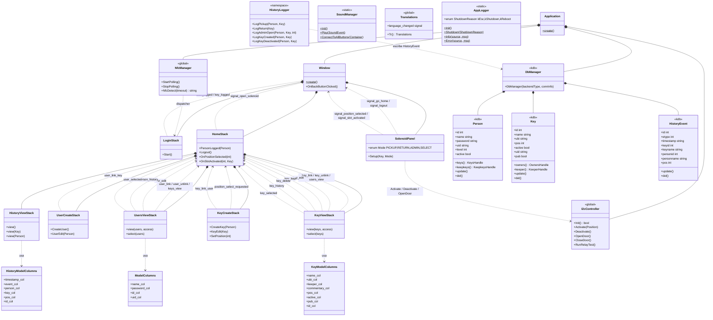

```mermaid
classDiagram
    direction TB

    %% ── Application ──────────────────────────────────────────────────
    class Application {
        +create()$
    }
    class Window {
        +create()$
        +OnBackButtonClicked()
    }

    %% ── UI Stacks ────────────────────────────────────────────────────
    class LoginStack {
        +Start()
    }
    class HomeStack {
        +PersonLogged(Person)
        +Logout()
        +OnPositionSelected(int)
        +OnSlotActivated(int, Key)
    }
    class SolenoidPanel {
        +enum Mode PICKUP,RETURN,ADMIN,SELECT
        +Setup(Key, Mode)
    }
    class UsersViewStack {
        +view(users, access)
        +select(users)
    }
    class UserCreateStack {
        +CreateUser()
        +UserEdit(Person)
    }
    class KeyViewStack {
        +view(keys, access)
        +select(keys)
    }
    class KeyCreateStack {
        +CreateKey(Person)
        +KeyEdit(Key)
        +SetPosition(int)
    }
    class HistoryViewStack {
        +view()
        +view(Key)
        +view(Person)
    }

    %% ── Services / Globals ───────────────────────────────────────────
    class NfcManager {
        <<global>>
        +StartPolling()
        +StopPolling()
        +NfcDetect(timeout) string
    }
    class SoundManager {
        <<static>>
        +Init()$
        +Play(SoundEvent)$
        +ConnectToAllButtons(Container)$
    }
    class Translations {
        <<global>>
        +Tr() Translations
        +language_changed signal
    }
    class AppLogger {
        <<static>>
        +enum ShutdownReason kEsc,kShutdown,kReboot
        +Init()$
        +Shutdown(ShutdownReason)$
        +Info(source, msg)$
        +Error(source, msg)$
    }
    class HistoryLogger {
        <<namespace>>
        +LogPickup(Person, Key)
        +LogReturn(Key)
        +LogAdminOpen(Person, Key, int)
        +LogKeyCreated(Person, Key)
        +LogKeyDeactivated(Person, Key)
    }
    class I2cController {
        <<global>>
        +Init() bool
        +Activate(Position)
        +Deactivate()
        +OpenDoor()
        +CloseDoor()
        +RunRelayTest()
    }

    %% ── Database — kdb namespace ─────────────────────────────────────
    class DbManager {
        <<kdb>>
        +DbManager(backendType, connInfo)
    }
    class Person {
        <<kdb>>
        +id int
        +name string
        +password string
        +uid string
        +level int
        +active bool
        +keys() KeysHandle
        +keepkeys() KeepkeysHandle
        +update()
        +del()
    }
    class Key {
        <<kdb>>
        +id int
        +name string
        +ubi string
        +pos int
        +active bool
        +uid string
        +pub bool
        +owners() OwnersHandle
        +keeper() KeeperHandle
        +update()
        +del()
    }
    class HistoryEvent {
        <<kdb>>
        +id int
        +etype int
        +timestamp string
        +keyid int
        +keyname string
        +personid int
        +personname string
        +pos int
        +update()
        +del()
    }

    %% ── GTK Tree Models ──────────────────────────────────────────────
    class ModelColumns {
        +name_col
        +password_col
        +id_col
        +uid_col
    }
    class KeyModelColumns {
        +name_col
        +ubi_col
        +keeper_col
        +commentary_col
        +pos_col
        +active_col
        +pub_col
        +id_col
    }
    class HistoryModelColumns {
        +timestamp_col
        +event_col
        +person_col
        +key_col
        +pos_col
        +id_col
    }

    %% ── Composición ──────────────────────────────────────────────────
    Application *-- Window
    Application *-- DbManager
    Application *-- I2cController
    Application *-- NfcManager
    Window *-- LoginStack
    Window *-- HomeStack
    Window *-- SolenoidPanel
    HomeStack *-- UsersViewStack
    HomeStack *-- UserCreateStack
    HomeStack *-- KeyViewStack
    HomeStack *-- KeyCreateStack
    HomeStack *-- HistoryViewStack
    DbManager *-- Person
    DbManager *-- Key
    DbManager *-- HistoryEvent

    %% ── Señales / Dependencias UI ────────────────────────────────────
    NfcManager ..> LoginStack : dispatcher
    LoginStack ..> Window : user_logged / key_logged
    HomeStack ..> Window : signal_open_solenoid
    SolenoidPanel ..> Window : signal_go_home / signal_logout
    SolenoidPanel ..> Window : signal_position_selected / signal_slot_activated

    UsersViewStack ..> HomeStack : user_link / user_unlink / keys_view
    UsersViewStack ..> HomeStack : user_edit
    UsersViewStack ..> HomeStack : person_history
    UsersViewStack ..> HomeStack : user_selected

    KeyViewStack ..> HomeStack : key_link / key_unlink / users_view
    KeyViewStack ..> HomeStack : key_edit
    KeyViewStack ..> HomeStack : key_kept
    KeyViewStack ..> HomeStack : key_delete
    KeyViewStack ..> HomeStack : key_history
    KeyViewStack ..> HomeStack : key_selected

    KeyCreateStack ..> HomeStack : position_select_requested
    KeyCreateStack ..> HomeStack : key_link_user
    UserCreateStack ..> HomeStack : user_link_key

    %% ── Hardware / Acceso a datos ────────────────────────────────────
    SolenoidPanel ..> I2cController : Activate / Deactivate / OpenDoor
    HistoryLogger ..> DbManager : escribe HistoryEvent
    UsersViewStack ..> ModelColumns : usa
    KeyViewStack ..> KeyModelColumns : usa
    HistoryViewStack ..> HistoryModelColumns : usa
```
